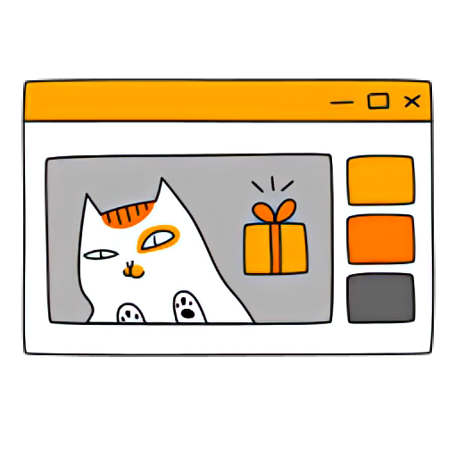

## Hi, I'm Wildannn </h2>

🌐 https://wildanzr.my.id
<!-- Talking about you -->
**Talking about Personal Stuffs:**

<!-- Any image aligned to the right. Beware the width -->

- 🧑‍🎓 Student of Information Technology Education at University of Brawijaya.
- 🤓 Currently exploring MERN Stack and learning Web3.
- 🐈 Cat addict.
- 📚🎬 Love reading histories, politics, and conspiracy also watching documentaries.
- ⚡️ Fun-Fact: I didn't smoke or drunk.

### Languages:

  
  
  
  
  
  

 

### Developments:

  
  
  
  
  
  
  
  
  

 

### Clouds:

  
  
  
  

 

### UIs:

  
  
  
  
  

